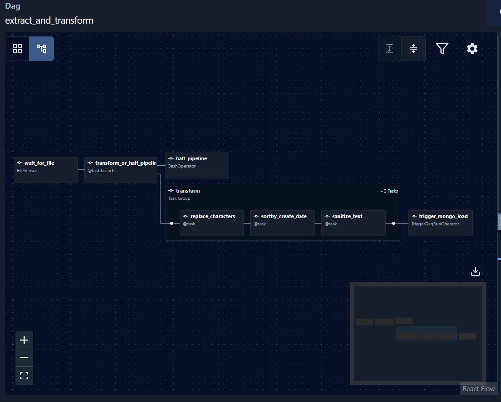
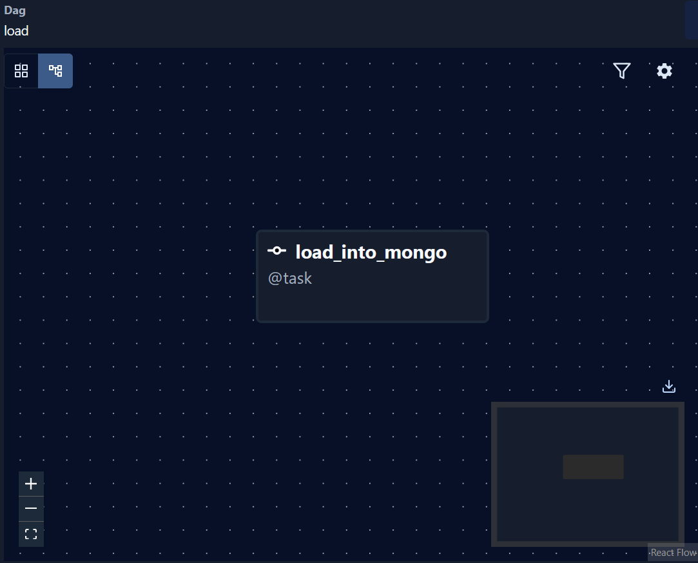

# Airflow


# Mongo
## Top 5 frequently occurring comments
```bash
[
  { "$group": { "_id": "$comment", "count": { "$sum": 1 } } },
  { "$sort": { "count": -1 } },
  { "$limit": 5 }
]
```
## All entries where the `content` field is less than 5 characters long
```bash
[
    {
    "content": { "$type": "string" },
    "$expr": { "$lt": [{ "$strLenCP": "$content" }, 5] }
    }
]
```
## Average rating for each day (the result should be in timestamp type)
```bash
[
  {
    "$match": {
      "at": { "$type": "string", "$ne": "" },
      "score": { "$exists": true, "$ne": null }
    }
  },
  {
    "$group": {
      "_id": {
        "$dateTrunc": { 
          "date": { "$toDate": "$at" }, 
          "unit": "day" 
        }
      },
      "averageRating": { "$avg": "$score" }
    }
  },
  {
    "$project": {
      "_id": 0,
      "date": "$_id",
      "averageRating": 1,
      "timestamp": { "$toLong": "$_id" }
    }
  },
  {
    "$sort": { "timestamp": 1 }
  }
]
```